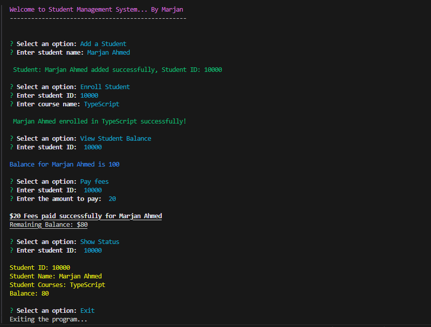

# Student Management System
## Description
The Student Management System is a command-line application built using TypeScript and the inquirer library for user interaction. The system allows for the management of student information including adding students, enrolling them in courses, viewing balances, paying fees, and displaying student status. The project uses object-oriented programming (OOP) principles to ensure a modular and maintainable codebase.

## Features
- Add new students 
- Enroll students in courses
- View student balances
- Pay student fees
- Display student status

## Technologies Used
- TypeScript
- Node.js
- Inquirer.js
- Chalk

## Installation

### Clone the repository:

```sh
git clone https://github.com/marjan-ahmed/Student-Management-System-OOPS.git
cd student-management-system

```
### Install the dependencies:

```sh
npm install
```

# Contributing
Contributions are welcome! Please create a pull request with your changes.

# License
This project is licensed under the MIT License. See the LICENSE file for details.

## Result
